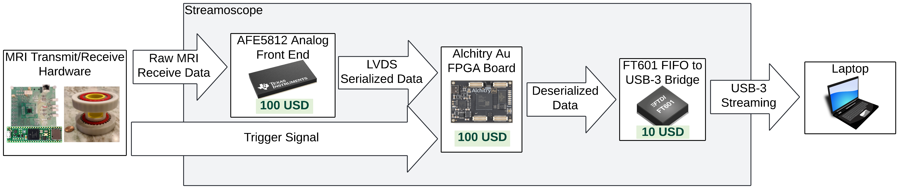
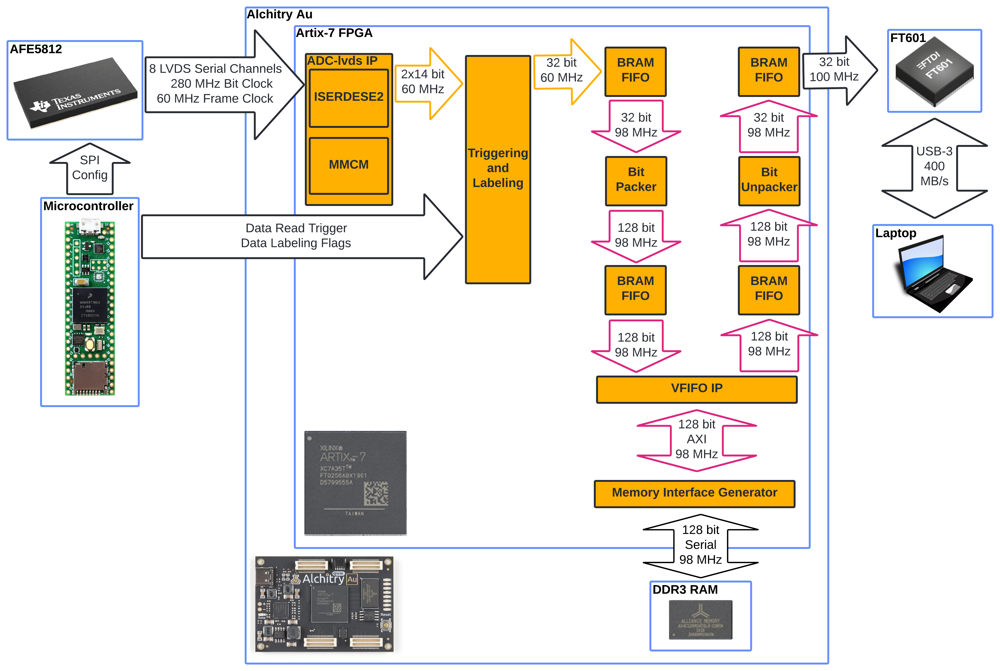
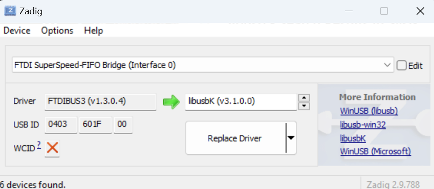

# Streamoscope
The Streamoscope is a USB-3 data acquisition system designed for low-field MRI, but could be more generally used. It streams two channels at 60 megasamples per second with 14-bit precision and costs around $300 in parts. It can read in data with low latency and the limit of how much can be read is only limited by the RAM on your computer!



It reads in 8 channels of data from the [AFE5812 analog front end chip](https://www.ti.com/product/AFE5812) into an [Alchitry Au FPGA board](https://www.sparkfun.com/products/16527), which feeds it into an [FT601 FIFO-to-USB-3 Bridge](https://ftdichip.com/products/ft601q-b/) which can be read into [Python](https://www.python.org/). Due to bandwidth constraints of the FT601, it only streams two channels. However, more could be streamed with a modified FPGA design that decimates the signals or decreases their precision.



What follows are guides on how to access the various components of the system. To summarize them:

* PCB design files from KiCad
* Python code for reading in data from the FT601
* Teensy code for configuring the AFE5812
* How to configure the Alchitry Au FPGA
* A Vivado project for the FPGA design


# PCB

The PCB design was done in [KiCad 8.0](https://www.kicad.org/) and can be found in ```streamoscope/hardware/kicad_design```. There are custom footprints used, which are accessible in this [library](https://github.com/JosephFeld/Handheld-MRI-Parts). Special thanks to [Lopfi for making the Alchitry Au footprint](https://github.com/Lopfi/alchitry-element-kicad).


# Python Setup

Streamoscope data can be read into Python, and this guide will walk through setting up the Jupyter Notebook example. This uses Python 3, which can be downloaded [here](https://www.python.org/downloads/).

## Installing libusb

First, we need to install [libusb](https://libusb.info/).

### MacOS

On MacOS, run these commands in the terminal: 
```
brew install libusb
sudo ln -s /opt/homebrew/lib/libusb-1.0.0.dylib /usr/local/lib/libusb.dylib
```

### Windows

On Windows, download the latest libusb Windows binaries [here](https://libusb.info/) under Downloads>Latest Windows Binaries.

Unzip the file and choose a version corresponding to your operating system. A good default is the newest Visual Studio folder VS2022. Choose the subfolder corresponding to your operating system, either 32 or 64 for 32-bit or 64-bit systems, respectively. Copy ```libusb-1.0.dll``` in the ```dll``` folder into ```C:/Windows/System32```, which will require admin approval. ```libusb-1.0.dll``` can also be placed into the same directory as the python script, ```streamoscope/software/python_reading``` for this example.

The FT601 on the Streamoscope may have the incorrect drivers. To fix this, install [Zadig](https://zadig.akeo.ie/) and run it.

* Select Options\>List All Devices
* Select FTDI SuperSpeed-FIFO Bridge (Interface 0)
* Use the arrows on the right to select libusbK as the new driver.

Here's what it should look like:


* Click "Replace Driver"


## Python dependencies


Then install the Python dependencies

```
pip install libusb, pyusb, matplotlib, numpy, scipy, jupyter
```

## Jupyter Notebook Setup

In the terminal, cd into ```streamoscope/software/python_reading``` and run this command to start up the Jupyter Notebook:

```jupyter notebook .\spin_echo_reader.ipynb```


# Teensy Setup

The Streamoscope uses a Teensy 4.1 microcontroller to configure the AFE5812 Analog Front End and ADC. The software for programming the Teensy can be found [here](https://www.pjrc.com/teensy/td_download.html).

To plug the Teensy into the Streamoscope, connect these pins:

| Streamoscope Pin | Teensy Pin |
| ---------------- | ---------- |
| ADC_RESET        | 3          |      
| MISO             | 39         |
| MOSI             | 26         |
| SCLK             | 27         |
| CS_AFE           | 38         |

And program the Teensy using the code in ```streamoscope\software\teensy_4_1_afe5812_config\teensy_4_1_afe5812_config.ino```. Every time the Teensy powers up, it reconfigures the AFE5812. 


# Configuring Alchitry Au

The Alchitry Au can be programmed using [Alchitry Loader](https://alchitry.com/alchitry-labs/) with the bitstreams found in ```streamoscope/fpga_configurations/```. It is also compatible with [openFPGALoader](https://github.com/trabucayre/openFPGALoader).

There is also a JTAG port broken out which can be used with JTAG programmers like [this](https://digilent.com/shop/jtag-hs3-programming-cable/), which can enable use of the Vivado ILA.

Here are descriptions of each bitstream:

| Filename | Description |
| ---------------- | ---------- |
| teensy_triggered.bit  | Streams channels 1 and 3 with data validity set by GPIO_0 (active high). This is useful for individual spin echoes. |      
| teensy_triggered_with_500ms_trigger_extension.bit | Streams channels 1 and 3 with data validity set by GPIO_0 (active high). Validity lasts an extra 500 milliseconds after GPIO_0 goes low. This is useful for fast imaging sequences. |


# Vivado Project Setup
The FPGA design was made in [Vivado 2023.2](https://www.xilinx.com/support/download/index.html/content/xilinx/en/downloadNav/vivado-design-tools/2023-2.html). It is only necessary to use this if you need to modify the HDL on the FPGA since There is already a provided FPGA configuration.

Open the Vivado GUI, go to the tcl console on the bottom, and cd into the ```streamoscope/hdl/Streamoscope/``` directory. Then run this command:

```
source Streamoscope.tcl
```

Then wait for a bit while the project configures. It will open up the new Streamoscope project. Then in the new project's tcl console, generate the modified ADC LVDS IP with these commands:

```
cd ../ADC-lvds-main/ip
source adc_lvds_ip.tcl
```

Then run this command in the Streamoscope tcl console to update the IP catalog:

```
update_ip_catalog -rebuild
```
